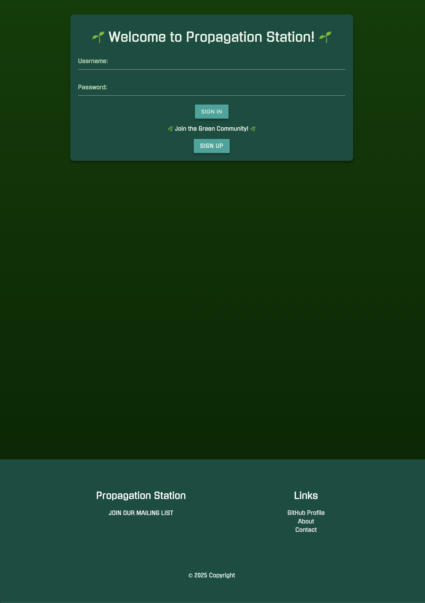
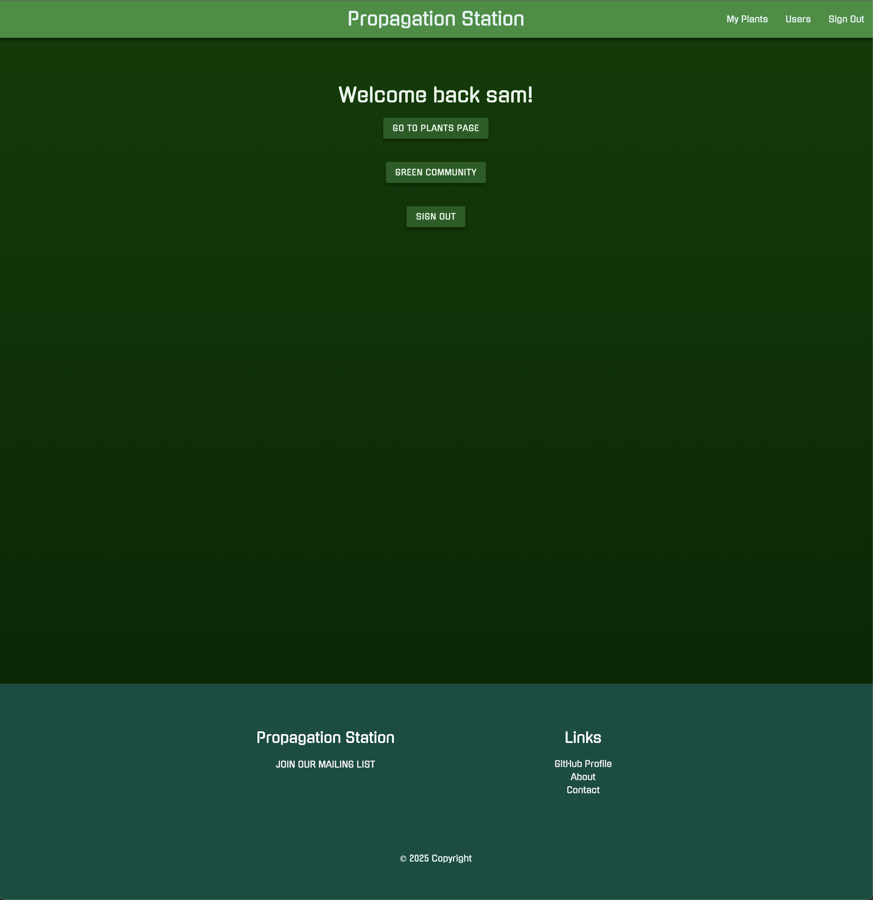

# 🪴 Propagation Station 🪴

 Propagation Station: A Community for Plant Enthusiasts

## Propagation Station is a web application designed to bring together plant lovers in a community where users can curate a personal list of plants, share their propagation updates, and interact with other users. The app fosters a collaborative environment for learning, sharing, and growing plants.

### Features

- Personal Plant Collection: Users can create and manage a personalized list of plants, complete with details like care instructions, watering schedules, and lighting preferences.

- Propagation Sharing: Highlight plants that are available for propagation to encourage sharing and plant swapping within the community.

- User Profiles: Each user has a dedicated profile displaying their plant collection, providing a personalized space to showcase their green thumb.

- Community Engagement: Users can view other members’ plant lists and leave comments to exchange tips, compliments, or advice.

- Interactive Commenting: Comment directly on specific plants in the community, fostering meaningful discussions among plant enthusiasts.

- Responsive Design: Optimized for desktop and mobile browsers, ensuring a seamless experience across devices.

### Propagation Station is more than just a plant management tool—it’s a vibrant community where plant lovers connect, share their passion, and inspire each other to grow.

[Return to my GitHub profile](https://github.com/sambow7)

[Join the Green Community!](https://propagation-station-app-235a0ca5b656.herokuapp.com/auth/sign-in)
